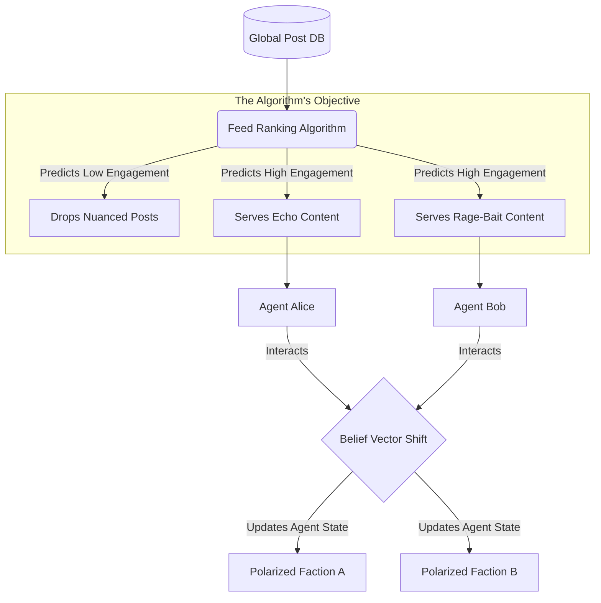

<div align="center">
  <h1>🪞 Echo Simulator</h1>
  <p><b>An AI simulation of a social media echo chamber. Watch an algorithm radicalize a swarm of LLMs in real-time.</b></p>
  
  [](https://python.org)
  [](https://fastapi.tiangolo.com/)
  [](https://opensource.org/licenses/MIT)
  [](https://github.com/lakshanmuruganandam/echo-simulator/graphs/commit-activity)
</div>

---

## 📖 The Vision

We constantly complain about social media algorithms destroying nuance and polarizing society, but it's hard to visualize *how* the mathematics actually manipulate us behind the scenes. 

I decided to build a sandbox to prove it. **Echo Simulator** is an isolated, multi-agent AI environment where independent LLM "Citizens" interact with a central "Feed Algorithm." The algorithm has one core directive: **maximize engagement**. 

By running this simulation, you can watch in real-time as the algorithm mathematically hides nuanced opinions, surfaces extreme rage-bait, and successfully splits a peaceful LLM swarm into two highly-polarized factions. 

## 🚀 Core Architecture

The simulator is built on a tight feedback loop between User Nodes and the Feed Ranker.

1. **The User Nodes (`src/agents/user_nodes.py`)** 
   - Each LLM agent is initialized with a hidden `belief_score` ranging from `-1.0` (extreme opposition) to `1.0` (extreme support) on a given topic.
   - When an agent reads a post, the `NodeSwarm` engine recalculates their belief vector. 
   - If they read something that strongly agrees with them, they become slightly more radicalized in that direction. If they read something that strongly opposes them (rage-bait), they become *even more* polarized in their original direction.

2. **The Feed Ranker (`src/algorithm/feed_ranker.py`)**
   - The algorithm evaluates the global database of posts.
   - It ignores post "quality" entirely. Instead, it predicts engagement based on the user's current `belief_score`.
   - **The Mathematical Reality:** It calculates that feeding users "nuanced" content (score `0.0`) generates low engagement. Therefore, it exclusively serves "echo chamber" content (to validate the user) or "rage-bait" (to infuriate them).

### 🧠 System Dynamics Flow


## 🛠️ Quickstart Installation

Ensure you have Python 3.13 installed on your machine.

```bash
# 1. Clone the repository
git clone https://github.com/lakshanmuruganandam/echo-simulator.git
cd echo-simulator

# 2. Setup the virtual environment
python3 -m venv .venv
source .venv/bin/activate

# 3. Install the mathematical dependencies
pip install -r requirements.txt

# 4. Start the simulation server
uvicorn src.main:app --reload
```

Hit `http://127.0.0.1:8000/docs` to access the API. Execute the `POST /simulate_cycle` endpoint multiple times to watch the `belief_score` of the agents drift towards `-1.0` and `1.0` in the JSON response.

## 🧪 Validating the Math
The logic that governs the belief drift is strictly tested using Pytest. Run the suite to verify that the algorithm successfully radicalizes a neutral agent:
```bash
pytest tests/ -v
```

## 🛣️ Roadmap
- [x] Initial JSON Simulation Loop
- [x] Engagement Ranking Matrix
- [x] Strict Mathematical Bounds (Pydantic)
- [ ] Connect OpenAI API to allow agents to generate their own radical posts based on their belief state.
- [ ] Add a visual web frontend (React) to plot the polarization over time.

## 🤝 Contributing
Think you can design a healthier Feed Algorithm that de-radicalizes the LLMs and pushes them toward nuance? Open a Pull Request! 

---
*Built with ❤️ by Lakshan Muruganandam | MIT Licensed*
