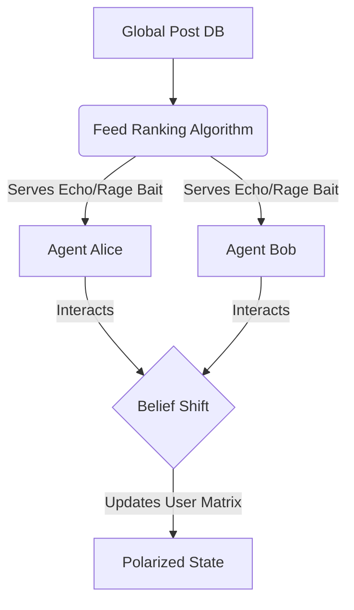

<div align="center">
  <h1>🪞 Echo Simulator</h1>
  <p><b>An AI simulation of a social media echo chamber. Watch an algorithm radicalize a swarm of LLMs in real-time.</b></p>
  
  
  
</div>

## 📖 The Story
We constantly complain about social media algorithms, but it's hard to visualize *how* they manipulate us. 

I decided to build a sandbox to prove it. **Echo Simulator** is a multi-agent system where independent LLM "Citizens" are fed content by a central "Feed Algorithm" designed strictly to maximize engagement. 

If you run the simulation long enough, the algorithm will mathematically hide nuanced opinions, surface rage-bait, and split the LLM swarm into two highly-polarized factions. 

## 🚀 How it Works
1. **The User Nodes (Agents):** Each LLM has a hidden `belief_score` ranging from `-1.0` to `1.0`. 
2. **The Algorithm (Feed Ranker):** Sorts the global database of posts based on projected engagement. It learns that feeding agents "nuanced" content generates 0 engagement, while feeding them "extreme agreement" or "rage-bait" spikes engagement.
3. **The Radicalization Loop:** As agents interact with the algorithm's feed, their `belief_score` mathematically shifts closer to the extremes. 

### 🧠 System Architecture


## 🛠️ Quickstart

```bash
# 1. Clone the repository
git clone https://github.com/lakshanmuruganandam/echo-simulator.git
cd echo-simulator

# 2. Setup the virtual environment
python3 -m venv .venv
source .venv/bin/activate

# 3. Install dependencies
pip install -r requirements.txt

# 4. Start the simulation server
uvicorn src.main:app --reload
```

Hit `http://127.0.0.1:8000/docs` and execute the `/simulate_cycle` endpoint to watch the radicalization unfold in the JSON response.

## 📦 Tech Stack
- **FastAPI:** Orchestrates the simulation loop.
- **Pydantic V2:** Strict mathematical bounds on belief vectors and engagement scoring.
- **Pytest-Asyncio:** Ensures the polarization math is functioning properly.

## 🤝 Contributing
Want to build a healthier feed algorithm to see if the LLMs can be de-radicalized? Open a Pull Request!

---
*Built with ❤️ by Lakshan Muruganandam*
